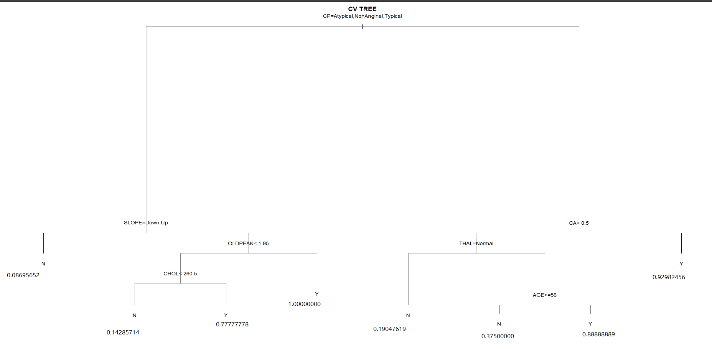

```{r setup, include=FALSE}
knitr::opts_chunk$set(echo = TRUE)
```
Read data sets
```{r}
library(readr)
fuel_ass3_2022 <- read.csv("fuel.ass3.2022.csv",header=T,stringsAsFactors=T)
View(fuel_ass3_2022)
```

Question 1 (8 marks)
This question will require you to analyse a regression dataset. In particular, you will be looking at
predicting the fuel efficiency of a car (in kilometers per litre) based on characteristics of the car and its
engine. This is clearly an important and useful problem. The dataset fuel.ass3.2022.csv contains
n = 500 observations on p = 9 predictors obtained from actual fuel efficiency tables for car models
available for sale during the years 2017 through to 2020. The target is the fuel efficiency of the car
measured in kilometers per litre. The higher this score, the better the fuel efficiency of the car. The
data dictionary for this dataset is given in Table 1. Provide working/R code/justifications for each of
these questions as required.

1. Fit a multiple linear model to the fuel efficiency data using R. Using the results of fitting the
linear model, which predictors do you think are possibly associated with fuel efficiency, and
why? Which three variables appear to be the strongest predictors of fuel efficiency, and why?
[2 marks]
```{r}
fit = lm(Comb.FE~.,fuel_ass3_2022)
summary(fit)
```


Looking at the p-values for each of the variables, we see that the predictors Eng.Displacement,AspirationSC,AspirationTC,AspirationTS,No.Gears,Lockup.Torque.ConverterY,Drive.SysF,Drive.SysP and Fuel.TypeGP seem to be borderline (p < 0.1) associated and are probably our best guesses, based on p-values, of which variables might be associated with Comb.FE.The three variables appear to be the strongest predictors of fuel efficiency are Eng.Displacement,AspirationTC and Drive.SysF because they have the three smallests p-values.

2. How would your assessment of which predictors are associated change if you used the Bonferroni procedure with α = 0.05? [1 marks]

Firstly,calculate the number of predictors,-1 to exclude intercept.
```{r}
num_pre<-length(coef(fit))-1
num_pre
```

```{r}
pvalues = coefficients(summary(fit))[,4]
pred12<-which(pvalues<0.05/num_pre)
pred12
```
Therefore,the predictorsEng.Displacement,AspirationTC,No.Gears,Drive.SysF are associated change while using the Bonferroni procedure with α = 0.05.

3. Describe what effect engine displacement (Eng.Displacement) appears to have on the mean
fuel efficiency of a car. Describe the effect that the Drive.SysF variable has on the mean fuel efficiency of a car. [2 marks]

Eng.Displacement has a negative effect on the car’s mean fuel efficiency. We can observe from question 1.1 that the coefficient of  Eng.Displacement is -1.331 which is below 0. This means in the same condition, the higher Eng.Displacement, the lower mean fuel efficiency.

 Drive.SysF has a positive effect on the car’s mean fuel efficiency. We can observe from question 1.1 that the coefficient of   Drive.SysF is  1.535 which is higher than 0. This means in the same condition, the higher Eng.Displacement, the higher mean fuel efficiency.


4. Use the stepwise selection procedure with the BIC penalty (using direction="both") to prune
out potentially unimportant variables. Write down the final regression equation obtained after
pruning. [1 mark]
Firstly, count number of rows in the data set.
```{r}
nrow(fuel_ass3_2022)
```
```{r}
fit_bic = step(fit,direction="both",k = log(nrow(fuel_ass3_2022)))
summary(fit_bic)
```
```{r}
fit_bic$coefficients
```

The final regression equation is:

E[Comb.FE] = 16.3611935-1.3164709*Eng.Displacement + 0.1336877*AspirationOT -0.5706151*AspirationSC-1.0717452*AspirationTC-1.3248883*AspirationTS -0.1747731*No.Gears-0.5731985 *Lockup.Torque.ConverterY+0.1934040*Drive.SysA+1.5475411*Drive.SysF-1.0801801*Drive.SysP+0.2842354*Drive.SysR

5. Imagine that you are looking for a new car to buy to replace your existing car. The characteristics
of the new car that you are looking at are given by the thirty-third row of the dataset.
(a) Use your BIC model to predict the mean fuel efficiency for this new car. Provide a 95%
confidence interval for this prediction. [1 mark]
```{r}
new_car <- fuel_ass3_2022[33,]
new_car_pred <- predict(fit_bic,newdata = new_car,interval = 'confidence')
new_car_pred
```

We are 95% confident that the mean fuel efficiency for this new car should be between 12.99409 and 13.75009.

(b) The current car that you own has a mean fuel efficiency of 11km/l (measured over the life
time of your ownership). Does your model suggest that the new car will have better fuel
efficiency than your current car? [1 mark]
Yes, because even the lower bound of the prediction in Q5(a) of mean fuel efficiency of the new car is 12.99409, which is  higher than 11km/l.

Question 2 (18 marks)
In this question we will analyse the data in heart.train.ass3.2022.csv. In this dataset, each
observation represents a patient at a hospital that reported showing signs of possible heart disease.
The outcome is presence of heart disease (HD), or not, so this is a classification problem. The predictors
are summarised in Table 2. We are interested in learning a model that can predict heart disease from
these measurements. To answer this question you must:
When answering this question, you must use the rpart package that we used in Studio 9. The
wrapper function for learning a tree using cross-validation that we used in Studio 9 is contained in the
file wrappers.R. Don’t forget to source this file to get access to the function.
Read the file
```{r}
heart_train_ass3_2022 <- read.csv("heart.train.ass3.2022.csv",header=T,stringsAsFactors=T)
View(heart_train_ass3_2022)
```

1. Using the techniques you learned in Studio 9, fit a decision tree to the data using the tree
package. Use cross-validation with 10 folds and 5, 000 repetitions to select an appropriate size
tree. What variables have been used in the best tree? How many leaves (terminal nodes) does
the best tree have? [2 marks]
```{r}
library(glmnet)
library(rpart)
library(randomForest)
library(kknn)
tree21 = rpart(HD ~ .,heart_train_ass3_2022)
tree21
```
```{r}
source("wrappers.R")
cv = learn.tree.cv(HD~.,data=heart_train_ass3_2022,nfolds=10,m=5000)
cv
```
The variables CP, SLOPE, OLD PEAK, CHOL, CA, THAL, and AGE have been used in the best tree.
The best tree have 8 leaves (terminal nodes).

2. Plot the tree found by CV. Clearly describe in plain English what conditions are required for the
tree to predict that someone has heart disease. (hint: use the text(cv$best.tree,pretty=12)
function to add appropriate labels to the tree). [3 marks]
```{r}
plot(cv$best.tree,main='CV TREE')
text(cv$best.tree,pretty=12,xpd=TRUE)
```
Conditions are required for the tree to predict that someone has heart disease are :
  1.Have Typical angina,Atypical angina or  Non anginal pain as Chest pain type, Slope of the peak exercise ST segment is flat,Exercise induced ST depression relative to rest is lower than 1.95 and  Serum cholesterol is higher than or equal to 260.5 mg/dl.
  2.Have Typical angina,Atypical angina or  Non anginal pain as Chest pain type, Slope of the peak exercise ST segment is flat,Exercise induced ST depression relative to rest is higher than or equal to 1.95.
  3.Have Asymptomatic pain as Chest pain type,Number of major vessels colored by flourosopy is smaller than 0.5,Thallium scanning results are Fixed fluid transfer defect or Reversible fluid transfer defect and younger than 56 years old(excluded).
  4.Have Asymptomatic pain as Chest pain type,Number of major vessels colored by flourosopy is greater than or equal to 0.5.


3. For classification problems, the rpart package only labels the leaves with the most likely class.
However, if you examine the tree structure in its textural representation on the console, you can
determine the probabilities of having heart disease (see Question 2.3 from Studio 9 as a guide)
in each leaf (terminal node). Take a screen-capture of the plot of the tree (don’t forget to use
the “zoom” button to get a larger image) or save it as an image using the “Export” button in R
Studio.
Then, use the information from the textual representation of the tree available at the console
and annotate the tree in your favourite image editing software; next to all the leaves in the tree,
add text giving the probability of contracting heart disease. Include this annotated image in
your report file. [1 mark]
```{r}

```

4. According to your tree, which predictor combination results in the lowest probability of having
heart-disease? [1 mark]
CP=Atypical,NonAnginal,Typical and SLOPE=Down,Up according to the graph.

5. We will also fit a logistic regression model to the data. Use the glm() function to fit a logistic regression model to the heart data, and use stepwise selection with the KIC score (using
direction="both") to prune the model. What variables does the final model include, and how
do they compare with the variables used by the tree estimated by CV? Which predictor is the
most important in the logistic regression? [3 marks]
```{r}
library(pROC)
fullmod=glm(HD~.,data=heart_train_ass3_2022,family=binomial)
summary(fullmod)
```
```{r}
fullmod.kic<-step(fullmod,direction = "both",k=3)
summary(fullmod.kic)
```
The final model include variable are: SEX,CP,TRESTBPS,CHOL,OLDPEAK,SLOPE,CA.

Compare with the variables used by the tree estimated by CV:
BOth of them have 7 variables.
Both of them include variables:
CHOL,OLDPEAK,SLOPE,CA and CP.
The difference is :
The CV decision tree model have THAL and AGE which logistic model don't have.
The logistic model have SEX and TRESTBPS which the CV decision tree model do not have.

CPNonAnginal is the most important predictor.Because its p-value is 3.32 x 10^(-6) which is the lowest.

6. Write down the regression equation for the logistic regression model you found using step-wise
selection. [1 mark]
```{r}
fullmod.kic$coefficients
```
Therefore,the regression equation for the logistic regression model should be:
E[HD]=-7.248412835+  1.802856259*SEXM -2.184816631*CPAtypical -2.599143599*CPNonAnginal -2.369843661*CPTypical + 0.021501131*TRESTBPS+  0.008166783*CHOL  +0.581819245*OLDPEAK+  1.931508302*SLOPEFlat+  0.206601760*SLOPEUp+1.074811459*CA 

7. Please describe the effect the variable CA has on heart-disease according to this logistic regression
model? [1 mark]
CA has a positive effect on the car’s mean fuel efficiency. We can observe from question 2.6 and 2.5 that the coefficient of CA is  1.074811459 which is higher than 0. This means in the same condition, the higher CA, the higher risk of contracting heart-disease.

8. The file heart.test.ass3.2022.csv contains the data on a further n
0 = 92 individuals. Using
the my.pred.stats() function contained in the file my.prediction.stats.R, compute the prediction statistics for both the tree and the step-wise logistic regression model on this test data.
Contrast and compare the two models in terms of the various prediction statistics? Does one
seem better than the other? Justify your answer. [2 marks]
```{r}
test <- read.csv("heart.test.ass3.2022.csv",header=T,stringsAsFactors=T)
View(test)
```

For the tree
```{r}
source("my.prediction.stats.R")
cat("The tree")
my.pred.stats(predict(cv$best.tree,test)[,2], test$HD)
```
The tree---------------------------------------------------------------------------
Performance statistics:

Confusion matrix:

    target
pred  N  Y
   N 47 14
   Y  6 25

Classification accuracy = 0.7826087 
Sensitivity             = 0.6410256 
Specificity             = 0.8867925 
Area-under-curve        = 0.8214804 
Logarithmic loss        = 87.37257

```{r}
cat("The step-wise logistic regression model")
my.pred.stats(predict(fullmod.kic,test,type="response"), test$HD)
```


The step-wise logistic regression model---------------------------------------------------------------------------
Performance statistics:

Confusion matrix:

    target
pred  N  Y
   N 45  8
   Y  8 31

Classification accuracy = 0.826087 
Sensitivity             = 0.7948718 
Specificity             = 0.8490566 
Area-under-curve        = 0.8853411 
Logarithmic loss        = 39.43705 

---------------------------------------------------------------------------

Contrast and compare the two models in terms of the various prediction statistics:
The tree preforms better in terms of Specificity(0.8867925>0.8490566) .The step-wise logistic regression model performs better in terms of lower in Logarithmic loss and higher in Classification accuracy,Sensitivity and Area-under-curve.

The step-wise logistic regression model seems better than the other one as it preforms better in most of performance statistics.And for Specificity, it is only a little bit lower than the tree.Therefore,the step-wise logistic regression model performs better as the prediction can be closer to the true value.

9. Calculate the odds of having heart disease for the 10th patient in the test dataset. The odds
should be calculated for both:
(a) the tree model found using cross-validation;
```{r}
pred9a=predict(cv$best.tree,test)[10,]
pred9a
```
odds:
```{r}
odds9a = pred9a[2]/pred9a[1]
odds9a
```


(b) the step-wise logistic regression model.
```{r}
pred9b=predict(fullmod.kic,test[10,],type="response")
pred9b
```
odds:
```{r}
odds9b=pred9b/(1-pred9b)
odds9b
```
Compare:
```{r}
odds9b/odds9a
```
This means the predict odds for the step-wise logistic regression model is 150.4888 times of the predict odds for the tree model found using cross-validation.

10. For the logistic regression model using only those predictors selected by KIC in Question 2.5, use
the bootstrap procedure (use at least 5, 000 bootstrap replications) to find a confidence interval
for the odds of having heart disease for the 65th and 66th patients in the test data. Use the bca
option when computing this confidence interval.
Using these intervals, do you think there is any evidence to suggest that there is a real difference
in the population odds of having heart disease between these two individuals? [2 marks]

```{r warning = FALSE}
library(boot)
set.seed(3000)
bt_65_func = function(formula, data, indices)
{
 d = data[indices,]
 
 fit = glm(formula, d, family=binomial)
 target = test[65,]
 pred_lg = predict(fit, target, type="response")
 odds_lg <- pred_lg / (1 - pred_lg)
 return (odds_lg)
}
bt65 <- boot(data=test, statistic=bt_65_func,R=5000, formula = HD ~ SEX + CP + TRESTBPS + CHOL + OLDPEAK + SLOPE + CA)
boot.ci(bt65, 0.95, type="bca")
```
For 65th patient,the confidence interval is (0, 1287882736).
```{r warning=FALSE}
library(boot)
set.seed(3000)
bt_66_func = function(formula, data, indices)
{
 # Create a bootstrapped version of our data
 d = data[indices,]
 
 fit = glm(formula, d, family=binomial)
 target = test[66,]
 pred_lg = predict(fit, target, type="response")
 odds_lg <- pred_lg / (1 - pred_lg)
 return (odds_lg)
}
bt66 <- boot(data=test, 
 statistic=bt_66_func,
 R=5000, formula = HD ~ SEX + CP + TRESTBPS + CHOL + OLDPEAK + SLOPE + CA)
boot.ci(bt66, 0.95, type="bca")

```
For 65th patient,the confidence interval is ( 0.0000,  3.3597 ).
The confidence interval for the 65th pateint is significantly wider than that of the 66th patient,which is the strong evidence to suggest that there is a real difference in the population odds of having heart disease between these two individuals.

Question 3 (14 marks)
Data Smoothing
Data “smoothing” is a very common problem in data science and statistics. We are often interested
in examining the unknown relationship between a dependent variable (y) and an independent variable
(x), under the assumption that the dependent variable has been imperfectly measured and has been
contaminated by measurement noise. The model of reality that we use is
y = f(x) + ε
where f(x) is some unknown, “true”, potentially non-linear function of x, and ε ∼ N(0, σ2
) is a random
disturbance or error. This is called the problem of function estimation, and the process of estimating
f(x) from the noisy measurements y is sometimes called “smoothing the data” (even if the resulting
curve is not “smooth” in a traditional sense, it is less rough than the original data).
In this question you will use the k-nearest neighbours machine learning technique to smooth data.
This technique is used frequently in practice (think for example the 14-day rolling averages used to
estimate coronavirus infection numbers). This question will explore its effectiveness as a smoothing
tool.
7
Mass Spectrometry Data Smoothing
The file ms.measured.2022.csv contains n = 501 measurements from a mass spectrometer. Mass
spectrometry is a chemical analysis tool that provides a measure of the physical composition of a
material. The outputs of a mass spectrometry reading are the intensities of various ions, indexed by
their mass-to-charge ratio. The resulting spectrum usually consists of a number of relatively sharp
peaks that indicate a concentration of particular ions, along with an overall background level. A
standard problem is that the measurement process is generally affected by noise – that is, the sensor
readings are imprecise and corrupted by measurement noise. Therefore, smoothing, or removing the
noise is crucial as it allows us to get a more accurate idea of the true spectrum, as well as determine
the relative quantity of the ions more accurately. However, we would also ideally like for our smoothing
procedure to not damage the important information contained in the spectrum (i.e., the heights of the
peaks).
The file ms.truth.2022.csv contains measurements of our mass spectrometry reading. The column
ms.measured.2022$MZ are the mass-to-charge ratios of various ions, and ms.measured.2022$intensity
are the measured (noisy) intensities of these ions in our material. The file ms.truth.2022.csv contains
the same n = 501 values of MZ along with the “true” intensity values (i.e., without added measurement
noise), stored in ms.truth.2022$intensity. These true values have been found by using several
advanced statistical techniques to smooth the data, and are being used here to see how close your
estimated spectrum is to the truth. For reference, the samples ms.measured.2022$intensity and the
value of the true spectrum ms.truth.2022$intensity are plotted in Figure 1 against their respective
MZ values.
To answer this question, you must use the kknn and boot packages that we used in Studios 9 and
10. You will be using the k-nearest neighbours method (k-NN) to estimate the underlying spectrum
from the training data. Use the kknn package we examined in Studio 9 to provide predictions for
the MZ values in ms.truth.2022, using ms.measured.2022 as the training data. You should use the
kernel = "optimal" option when calling the kknn() function. This means that the predictions are
formed by a weighted average of the k points nearest to the point we are trying to predict, the weights
being determined by how far away the neighbours are from the point we are trying to predict.

Read the file:
```{r}
ms_measured_2022 <- read.csv("ms.measured.2022.csv",header=T,stringsAsFactors=T)
View(ms_measured_2022)
```

```{r}
ms_truth_2022 <- read.csv("ms.truth.2022.csv",header=T,stringsAsFactors=T)
View(ms_truth_2022)
```
import library
```{r}
library(kknn)
library(rpart)
library(randomForest)
```

Questions
1. For each value of k = 1, . . . , 25, use k-NN to estimate the values of the spectrum associated with
the MZ values in ms.truth.2022$MZ. Then, compute the root-mean-squared error between your
estimates of the spectrum, and the true values in ms.truth.2022$intensity. Produce a plot of
these errors against the various values of k. [1 mark]
```{r}
ytest.hat<-list()
root_mean_squared_error=c()
for (i in 1:25){
      ytest.hat[[i]] = fitted( kknn(intensity ~ .,ms_measured_2022,ms_truth_2022,k=i,kernel="optimal") )
      root_mean_squared_error[i]=sqrt(mean((ytest.hat[[i]] - ms_truth_2022$intensity)^2))
}
```

```{r}
root_mean_squared_error
```

```{r}
plot((1:25),root_mean_squared_error,xlab='k',ylab='root-mean-squared error')
```
2. Produce four graphs, each one showing: (i) the training data points (ms.measured.2022$intensity)(ii) the true spectrum (ms.truth.2022$intensity) and (iii) the estimated spectrum (predicted
intensity values for the MZ values in ms.truth.2022.csv) produced by the k-NN method for
four different values of k; do this for k = 2, k = 6, k = 12 and k = 25. Make sure the information
presented in your graphs is clearly readable. [3 marks]
```{r}
plot(ms_measured_2022$MZ,ms_measured_2022$intensity,
 main = "k=2",
 ylab = "Intensitiy",
 xlab= "MZ",
 pch=20,
 cex=0.7,
 col = "red")
lines(ms_truth_2022$MZ,ms_truth_2022$intensity,col='green',lwd=2)
lines(ms_truth_2022$MZ,ytest.hat[[2]],col='blue',lwd=1)
legend("topright", c("estimated spectrum","true spectrum","training data points"), fill = c("blue", "green","red"))
```
```{r}
plot(ms_measured_2022$MZ,ms_measured_2022$intensity,
 main = "k=6",
 ylab = "Intensitiy",
 xlab= "MZ",
 pch=20,
 cex=0.7,
 col = "red")
lines(ms_truth_2022$MZ,ms_truth_2022$intensity,col='green',lwd=2)
lines(ms_truth_2022$MZ,ytest.hat[[6]],col='blue',lwd=1)
legend("topright", c("estimated spectrum","true spectrum","training data points"), fill = c("blue", "green","red"))
```
```{r}
plot(ms_measured_2022$MZ,ms_measured_2022$intensity,
 main = "k=12",
 ylab = "Intensitiy",
 xlab= "MZ",
 pch=20,
 cex=0.7,
 col = "red")
lines(ms_truth_2022$MZ,ms_truth_2022$intensity,col='green',lwd=2)
lines(ms_truth_2022$MZ,ytest.hat[[12]],col='blue',lwd=1)
legend("topright", c("estimated spectrum","true spectrum","training data points"), fill = c("blue", "green","red"))
```
```{r}
plot(ms_measured_2022$MZ,ms_measured_2022$intensity,
 main = "k=25",
 ylab = "Intensitiy",
 xlab= "MZ",
 pch=20,
 cex=0.7,
 col = "red")
lines(ms_truth_2022$MZ,ms_truth_2022$intensity,col='green',lwd=2)
lines(ms_truth_2022$MZ,ytest.hat[[25]],col='blue',lwd=1)
legend("topright", c("estimated spectrum","true spectrum","training data points"), fill = c("blue", "green","red"))
```


3. Discuss, qualitatively (i.e., visually), and quantitatively (in terms of root-mean-squared error
against the true spectrum) the effect of varying k on the estimate of the spectrum. [2 marks]

Qualitatively,The estimate of the spectrum gets smoother with the increase of k.

In terms of root-mean-squared error against the true spectrum, the RMSE decrease from k=2 to k=6 and reaches the lowest at k=6.Then the RMSE increase from k=6 to k=25.Therefore,the estimate of the spectrum get more an more accurate from k=2 to k=6 and  get less accurate with the increase of k after k=6.

4. Do any of the estimated spectra plotted in Q3.2 achieve our dual aims of providing a smooth,
low-noise estimate of background level as well as accurate estimation of the heights of the peaks?
Explain why you think the k-NN method is able to achieve, or not achieve, this aim. [2 marks]

k-NN method is able to achieve at k=6, here is the reason:

When k is very low(like 2),the peak is well estimated but it is noisy and not smooth.I found as k increase the peak become inaccurate but it become less noisy.

When k=6,our dual aims of providing a smooth,low-noise estimate of background level as well as accurate estimation of the heights of the peaks is achieved.The k-NN method is able to achieve the aim because the root-mean-squared error between the estimates of the spectrum and the true values is the lowest which means the estimates of the spectrum is closest to the true value when k=6.At k=6 we found the balance between smooth and accurate peak.

5. Use the cross-validation functionality in the kknn package to select an estimate of the best value
of k (make sure you still use the optimal kernel). What value of k does the method select?
How does it compare to the (in practice, unknown) value of k that would minimise the actual
mean-squared error (as computed in Q3.1)? [1 mark]

```{r}
knn <- train.kknn(intensity ~ ., data = ms_measured_2022, kmax=25, kernel="optimal")
ytest.hat35 <- fitted( kknn(intensity ~ ., ms_measured_2022, ms_truth_2022,
                         kernel = knn$best.parameters$kernel, k = knn$best.parameters$k) )
summary(knn)
```
The method select k value is 5.
```{r}
min35<-sqrt(mean((ytest.hat35 - ms_truth_2022$intensity)^2))
min31<-min(root_mean_squared_error)
min35
min31
```
The mean-squared error from Q3.1 is lower than that q3.5,which means using k=6 can make the prediction slightly more accurate than using  cross-validation functionality with k=5.

6. Using the estimate of the spectrum produced in Q3.5 using the value of k selected by cross validation, and the values in ms.measured.2022$intensity, see if you can think of a way to
find an estimate of the standard deviation of the sensor/measurement noise that has corrupted
our intensity measurements. [1 mark]
```{r}
var36<-sd(ytest.hat35 - ms_measured_2022$intensity)
var36

```
The estimate of the standard deviation of the sensor/measurement noise that has corrupted
our intensity measurements should be  0.5906997.

7. An important task when processing mass spectrometry signals is to locate the peaks, as this
gives information on which elements are present in the material we are analysing. From the
smoothed signal produced using the value of k found in Q3.5, which value of MZ corresponds to
the maximum estimated intensity? [1 mark]
```{r}
which.max(ytest.hat35)
```
```{r}
max(ytest.hat35)
```
```{r}
ms_measured_2022$MZ[160]
```
The value 8818 of MZ corresponds to the maximum estimated intensity.

8. Using the bootstrap procedure (use at least 5, 000 bootstrap replications), write code to find a
confidence interval for the k-nearest neighbours estimate of intensity at a specific MZ value. Use
this code to obtain a 95% confidence interval for the estimate of the intensity at the MZ value
you determined previously in Question 3.7 (i.e., the value corresponding to the highest intensity).
Compute confidence intervals using the k determined in Q3.5, as well as k = 3 neighbours and
k = 20 neighbours. Report these confidence intervals. Explain why you think these confidence
intervals vary in size for different values of k. [3 marks]
```{r warning=FALSE}
knn.boot <- function(data,
 indicies,
 k,
 i){
 result = fitted(kknn(k = k,
 intensity~.,
 data[indicies,],
 ms_truth_2022[i,],
 kernel = "optimal",
 ))
}
```
From Q3.5 ,k = 5:
```{r}
set.seed(3000)
knn.boot5 <- boot(ms_measured_2022,
 knn.boot,
 k = 5,
 R = 5000,
 i = which.max(ytest.hat35))
boot.ci(knn.boot5, type = "bca")
```
k=3:
```{r}
set.seed(3000)
knn.boot3 <- boot(ms_measured_2022,
 knn.boot,
 k = 3,
 R = 5000,
 i = which.max(ytest.hat[[3]]))
boot.ci(knn.boot3, type = "bca")
```
k=20:
```{r}
set.seed(3000)
knn.boot20 <- boot(ms_measured_2022,
 knn.boot,
 k = 20,
 R = 5000,
 i = which.max(ytest.hat[[20]])) 
boot.ci(knn.boot20, type = "bca")
```
Therefore, for k=3 the confidence interval is (26.66, 30.66 ).
For k=5 the confidence interval is (25.21, 30.57 )
For k=20,the confidence interval is (15.38, 26.63 ).
The bigger value of k, the wider the confidential interval is.
That is because the bigger the k value, the more individuals involved to make prediction.The increased number of individuals may increase the range and variance of data, which means the wider of confidence interval.
 
 
```{r}
sum(53.2, 33.6, 36.6, 42.0, 33.3, 37.8, 31.2, 43.4)/8
```

